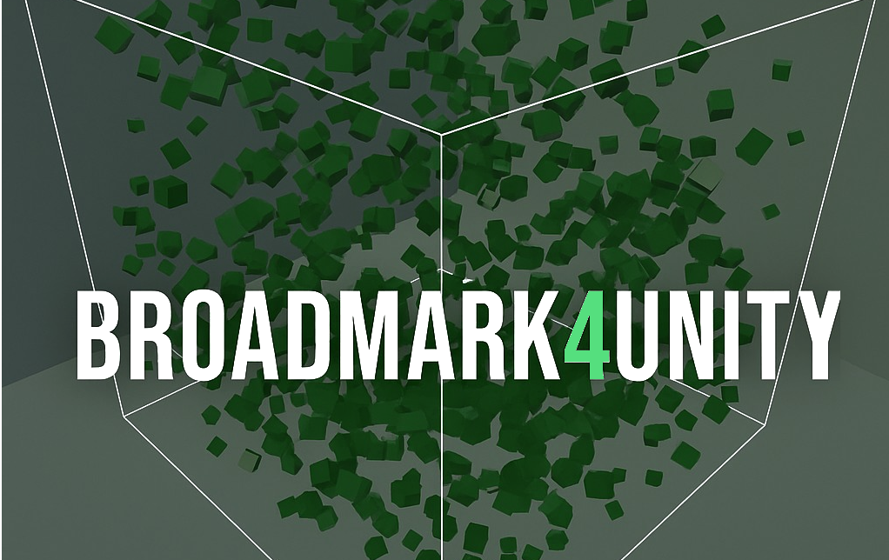
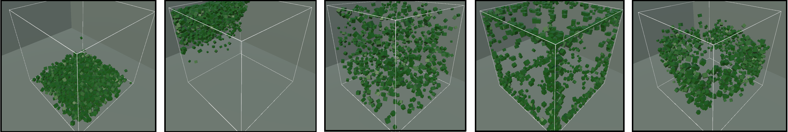

# Broadmark4Unity

**Broadmark4Unity** é um plugin que integra algoritmos validados do [Broadmark](https://github.com/) à engine Unity usando uma biblioteca externa em C++. O objetivo é permitir testes, comparações e visualizações de algoritmos de detecção de colisões na etapa de *broad phase* em tempo real.

---

## 📌 Funcionalidades

- Implementa 3 algoritmos: **Brute Force**, **Tracy** e **KD-Tree**
- Comunicação entre C# e C++ via **DLL**
- Cenários dinâmicos configuráveis na Unity
- Interface gráfica para escolher algoritmo, parâmetros e monitorar colisões em tempo real

---

## 📂 Scripts Principais

Os scripts estão em `Assets/Scripts/Algoritmos`:

| Algoritmo     | Script               | Função |
|---------------|----------------------|--------|
| **Brute Force** | `BroadmarkManager.cs` | Gerencia envio das AABB's e chamada do Brute Force |
| **Tracy**       | `TracyManager.cs`     | Gerencia envio das AABB's e chamada do Tracy |
| **KD-Tree**     | `KDManager.cs`        | Gerencia envio das AABB's e chamada do KD-Tree |

🔗 Funções Extras

Para o **KD-Tree**, há também a função `KD_GetPair` na DLL para obter os pares de colisão.

> **Como adicionar:**  
> Declare a função no seu script com `[DllImport]` seguindo o mesmo padrão das demais no KDManager.cs

Para usa-los basta enviar uma lista de AABB's como no scrip e seguir o fluxo de chamada de função.
Um exemplo de como calcular AABB rapdiamente está no script `AABBObjectController` dentro da pasta de scripts.

> Atenção: aqui o bounding box world padrão ( basicamente a área onde o algoritmo procura overlaps) que esta na dll.
       Seu AABB possui min e max de: min (-100.0f, -100.0f, -100.0f) , max (100.0f, 100.0f, 100.0f)
---

## Cenários Teste

Abaixo, um exemplo de Cenários dinâmicos configuráveis na Unity:



- {Free Fall:} objetos caindo sob gravidade constante.
- Rotating Gravity:} gravidade variável simulando ambientes rotativos.
- {Brownian:} movimentos aleatórios típicos de partículas.
- {Random Gravity:} vetores de gravidade individuais por objeto.
- {Hurricane:} alta rotação de objetos em torno de um centro.


---

## 🚀 Como usar

1. **Clone o repositório**
   ```bash
   git clone https://github.com/alminha021/broadmark4unity.git


Sinta-se livre para utilizar os 3 scripts que possuem os algoritmos a vontade.


----------------
